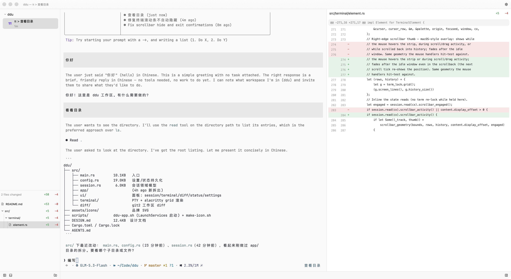

# Day Day Up

**ddu** is a native workspace for AI coding agents — macOS and Linux: run **claude**, **codex**, or a plain shell session in any project — several at once — and watch the working tree's git diff update live in the next pane. One window, three panes, everything in view.

> Inspired by [Zed](https://zed.dev) — for the feel of a fast, native UI, not its code. Built on [gpui](https://github.com/zed-industries/zed) and [gpui-kit](https://github.com/longbridge/gpui-kit).

<p align="center">
  
</p>

## What you get

- **Three-pane workspace** — projects and agent sessions on the left, a real terminal in the center, the project's live git diff on the right. Panes are resizable; the side panels collapse when you don't need them.
- **Real terminals, not a text box** — every session runs in a PTY with streaming ANSI color, scrollback, and live resize, so agent CLIs behave exactly as they do in your shell.
- **Live git diff** — working tree vs. HEAD: modified, staged, and untracked files with per-file `+`/`−` stats, refreshed automatically as your agents edit.
- **The file, not just the diff** — the changes pane shows the whole file with the diff tinted in place (and `@@` hunks a keystroke away), syntax-highlighted per row for c/c++, Java, HTML, CSS, JS/JSX, TS/TSX, Rust, Go, Python, Swift, shell and JSON. Markdown renders as a document (images included); an image file is drawn as one. A thin overview strip beside the rows marks every added and removed run and shows where the viewport sits — click a mark to jump to that change — and each file reopens where you left it.
- **The whole working tree, findable** — the sidebar lists every file (git's ignore rules respected, changed files carrying their `+/−` figures), sorted case-insensitively, with `⌘P`/`Ctrl+P` to search it: type a fragment like `difpan`, and the ranked hits open with a keystroke.
- **Session lifecycle** — spawn, kill, and restart sessions; a run that finishes or fails is reported on its own row (status and duration), and an agent's "your turn" marker raises a desktop notification while you're looking elsewhere. ddu keeps each session's conversation id, so an agent chat can be resumed later (`claude --resume` / `codex resume`) — and the sessions that were still running when you quit come back running on the next launch, agents resumed from that id.
- **Settings window** — theme, shell, and terminal font, in a dedicated window (`⌘,` / `Ctrl+,`).
- **Persistent workspace** — projects, panel layout, and per-project diff state survive relaunches (`~/Library/Application Support/ddu/` on macOS, `~/.config/ddu/` on Linux), and every session that was still running is started again.

## Keyboard shortcuts

Every shortcut uses the platform's primary modifier: `⌘` on macOS, `Ctrl` on Linux. Copy, paste and find are the exception — a terminal shares those keys with the shell it runs, so on Linux they move to `Ctrl+Shift` (`Ctrl+C` stays SIGINT).

| Action | macOS | Linux |
| --- | --- | --- |
| New agent session | `⌘N` | `Ctrl+N` |
| Add project (folder picker) | `⌘O` | `Ctrl+O` |
| Select the Nth session | `⌘1`…`⌘9` | `Ctrl+1`…`Ctrl+9` |
| Toggle the diff file tree | `⌘T` | `Ctrl+T` |
| Toggle the sessions sidebar | `⌘B` | `Ctrl+B` |
| Toggle the diff panel | `⌘R` | `Ctrl+R` |
| Find a file (quick open) | `⌘P` | `Ctrl+P` |
| Next / previous search result | `⌘G` / `⌘⇧G` | `Ctrl+G` / `Ctrl+Shift+G` |
| Close session | `⌘W` | `Ctrl+W` |
| Copy / paste (terminal and changes pane) | `⌘C` / `⌘V` | `Ctrl+Shift+C` / `Ctrl+Shift+V` |
| Find in terminal / changes | `⌘F` | `Ctrl+Shift+F` |
| Zoom the terminal font | `⌘+` / `⌘−` | `Ctrl++` / `Ctrl+−` |
| Open settings | `⌘,` | `Ctrl+,` |
| Quit | `⌘Q` | `Ctrl+Q` |

A chord the app binds never reaches the shell, so on Linux `Ctrl+R`, `Ctrl+N`, `Ctrl+O`, `Ctrl+T`, `Ctrl+B`, `Ctrl+W` and `Ctrl+P` are ddu's, not readline's; everything unbound (`Ctrl+A/E/K/U/L/D/Z`, …) goes to the shell as usual.

## Getting started

Requirements: macOS 13+ or Linux (X11/Wayland, Vulkan or GL), plus a Rust toolchain. Agent sessions need the `claude` or `codex` CLI on your `PATH`; the plain terminal preset works out of the box.

### Linux

```sh
git clone https://github.com/justmao945/ddu.git
cd ddu
scripts/linux.sh run        # build --release, run from $DDU_DIR (default: this repo)
scripts/linux.sh install    # ~/.local/bin/ddu + a desktop entry
```

The launched directory *is* the workspace ddu opens on (`DDU_DIR` overrides it for `run`, and is baked into the desktop entry's launch path at install time; `DDU_INSTALL_DIR` overrides the install prefix). State lives in `$XDG_CONFIG_HOME/ddu/` (default `~/.config/ddu/`) — `DDU_STATE_PATH` / `DDU_SETTINGS_PATH` name the two files directly, which is also how the screenshots above were staged.

### macOS

```sh
scripts/dev.sh
```

`scripts/dev.sh` builds the release binary, packages it into `target/ddu-dev.app` as "Day Day Up Dev" (`dev.just.ddu.dev`), and opens it through LaunchServices — always launch the app this way. Dev state is isolated under `~/Library/Application Support/ddu-dev/`, so it never mixes with an installed copy's state. Set `DDU_DIR` to open a different workspace root (defaults to `~/Code/ddu`).

To install the app into `/Applications` under the official identity ("Day Day Up", `dev.just.ddu`), run `scripts/install.sh` (add `--open` to launch it right away; `DDU_INSTALL_DIR` overrides the destination). The dev and installed bundles have different ids, so both can run side by side.

## Under the hood

[gpui](https://github.com/zed-industries/zed) via [gpui-kit](https://github.com/longbridge/gpui-kit) for UI, [alacritty_terminal](https://crates.io/crates/alacritty_terminal) for the terminal grid and ANSI parsing, [portable-pty](https://crates.io/crates/portable-pty) for PTYs, and [git2](https://crates.io/crates/git2) for diffs. Apache-2.0 throughout the app, GPL-free.

## Beyond the app

Two things in this repo are not part of the Rust build:

- [`contrib/usage/`](contrib/usage/) — **UsageTray**: a macOS menu-bar tray (Swift) showing live plan usage for Kimi Code, Zhipu GLM Coding Plan, OpenCode Go and Command Code, plus an Omarchy bar-widget port of the same four providers. MIT-licensed, see [`contrib/usage/LICENSE`](contrib/usage/LICENSE).
- [`docs/omarchy/`](docs/omarchy/) — notes on the Omarchy desktop tweaks ddu lives alongside: the text-size switch (the same one ddu's UI scale follows) and the fcitx5 input panel.

## License

Apache-2.0 for the app; `contrib/usage/` is MIT.
