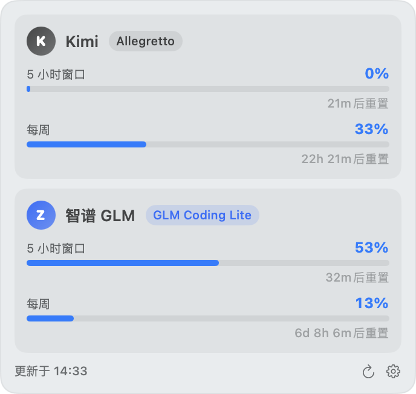

# UsageTray

Part of the [ddu](../../) repository (MIT-licensed; the app itself is Apache-2.0).

macOS menu bar tray: live plan usage for Kimi Code, Zhipu GLM Coding Plan, OpenCode Go, and Command Code — no browser needed.


Tap a tray icon to pop up that provider's usage panel with window progress, reset countdown, and plan tier:



## Features

- **Menu bar icons**: one icon per provider ("brand avatar + two-line percentages", top: 5-hour window, bottom: weekly); tapping one expands only that provider's panel. Usage ≥70% turns orange, ≥90% red; a fallback icon remains when everything is disabled.
- **Dropdown panel**: per-window progress bars and reset countdowns; the plan capsule is clickable and opens the provider's official usage page.
- **Background auto refresh**: starts on launch, default every 2 minutes, adjustable to 30s / 1 / 2 / 5 min; opening a panel force-refreshes immediately (usage + plan name), with at most one round of requests in flight at any moment.
- **Settings** (gear in the panel's bottom-right, separate window): enter API keys (OpenCode / Command Code can be left empty to reuse the CLI logins), toggle providers, adjust the refresh interval.

## Omarchy Plugin (Linux)

`omarchy/` is a `bar-widget` plugin (`just.usage`) porting the same four providers to the Omarchy bar: the pill shows one badge per configured provider (letter avatar + 5-hour percent; ≥70% theme orange, ≥90% urgent), clicking a badge opens that provider's panel with per-window progress bars, reset countdowns and a settings section (toggles, API keys, refresh interval — persisted to the widget's `shell.json` entry). The gaps between badges are inert; right-click refreshes. Fetching runs in `usage_fetch.py` (same endpoints as below, Bearer auth); OpenCode / Command Code keys can stay empty to reuse the CLI logins. Zhipu plan name is fetched every round (cheap, one extra call).

```sh
cp -r omarchy ~/.config/omarchy/plugins/usage
omarchy bar put just.usage --section right
# optional keys: omarchy bar set just.usage kimiKey sk-kimi-… zhipuKey …
```

If an upstream field changes, fix `omarchy/usage_fetch.py` (parsing) and `omarchy/Model.js` (display).

## Build & Run (macOS)

Requires Swift 5.9+ (Xcode command line tools):

```sh
./build.sh
open build/UsageTray.app
```

The product is `build/UsageTray.app` (`LSUIElement`, no Dock icon). Drag it into Applications and add it to Login Items in System Settings for autostart.

## Configuration

First run: tap the gear in the panel's bottom-right to open Settings, then enter API keys (stored in plain text at `~/Library/Application Support/UsageTray/config.json`):

| Provider | Key format | Where to get it |
|---|---|---|
| Kimi | `sk-kimi-…` (Coding Plan key, not the open-platform one) | Kimi Code subscription page on [kimi.com](https://www.kimi.com) |
| Zhipu GLM | Open-platform API key with a GLM Coding Plan subscription | [bigmodel.cn console](https://open.bigmodel.cn) |
| OpenCode | `sk-…`; leave empty to auto-read `~/.local/share/opencode/auth.json` (the `opencode-go` entry) | Written by the CLI after subscribing at [opencode.ai/go](https://opencode.ai/go) |
| Command Code | `user_…`; leave empty to auto-read `~/.commandcode/auth.json` (the `apiKey` field) | Written by `cmd` after logging in at [commandcode.ai](https://commandcode.ai) |

## Data Sources

Usage comes from the same internal endpoints the subscription consoles use (Bearer auth with the plan key):

- Kimi: `GET https://api.kimi.com/coding/v1/usages` (falls back to `/usage` on 404)
- Zhipu: `GET https://open.bigmodel.cn/api/monitor/usage/quota/limit` + `GET /api/biz/subscription/list`
- OpenCode Go: `GET https://opencode.ai/zen/go/v1/usage` (rolling / weekly / monthly windows with percent and reset time)
- Command Code: `GET https://api.commandcode.ai/alpha/billing/credits` (`windowLimits.fiveHour/weekly` used/cap/resetAt) + `GET /alpha/billing/subscriptions` (plan tier) + `GET /alpha/usage/summary` (monthly credit consumption)

If an upstream field changes, the parsing lives in `Sources/UsageTray/Providers.swift` — one place to fix.

## License

MIT — see [LICENSE](LICENSE).
